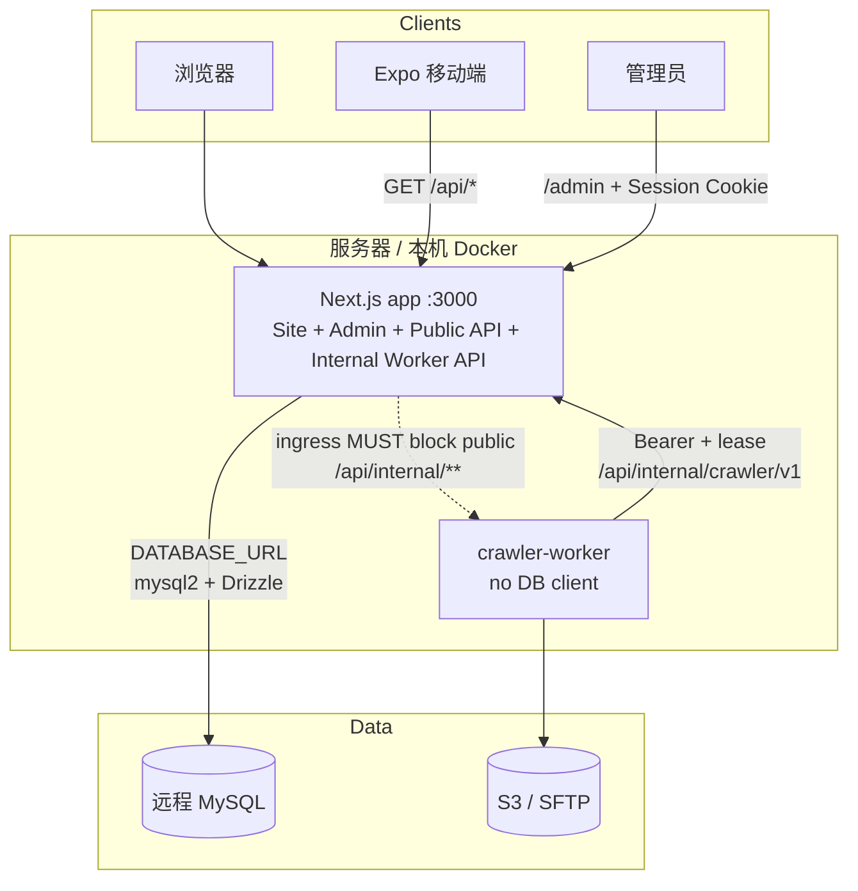
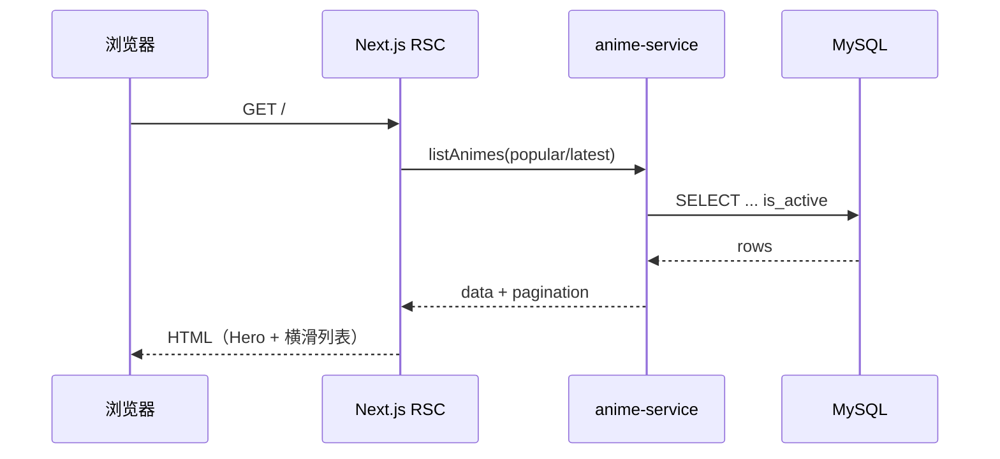
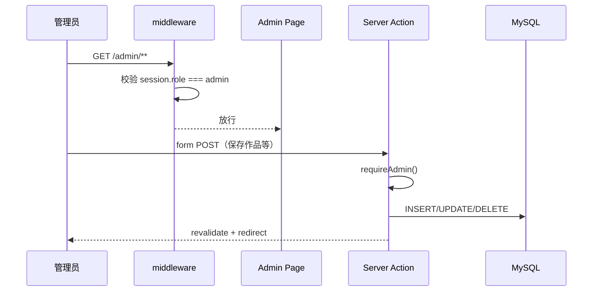
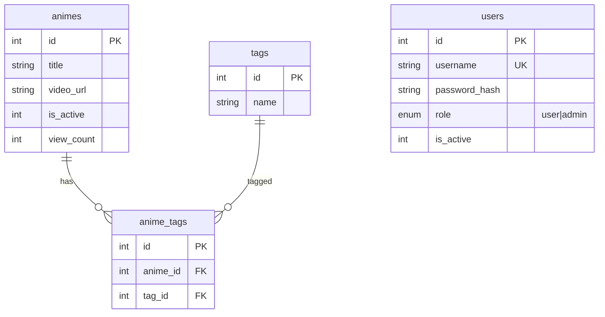

# AnimeStream 架构说明

## 1. 系统概览

AnimeStream 是单进程 **Next.js 15（App Router）** 应用，同时提供：

- 公网站点（片库 / 搜索 / 播放）
- 管理后台（`/admin`）
- 公开 REST API（`/api/*`，供 Web 与移动端）

业务数据存放在**既有远程 MySQL**，Docker Compose **不**包含数据库容器。



## 1.1 爬虫控制面

- 后台：`/admin/crawler/**`（模板、调度、任务、存储、密钥、YAML 导入）
- Worker API：`/api/internal/crawler/v1/**`（见 `docs/api/crawler-internal-openapi.yaml`）
- 运行时：`crawler_worker/`（无 PyMySQL / DATABASE_URL）
- 遗留直写脚本 `scripts/production_crawler.py` / `unified_crawler.py` / `crawler_config.py` **已物理删除**
- 旧爬虫与应用共用同一 MySQL 用户时**不会** DROP 该账号（避免拖垮主站）；凭据已从 `production_config.yml` 清空。若存在独立 `CRAWLER_DB_USER`，用 `node scripts/revoke-legacy-crawler-db.mjs` 撤销

## 2. 运行时职责划分

| 层 | 路径 / 模块 | 职责 |
|----|-------------|------|
| 前台页面 | `app/(site)/**` | RSC 拉取列表/详情，Client 组件负责轮播与分页交互 |
| 后台页面 | `app/admin/**` | Server Actions 写库；middleware 校验 `role=admin` |
| 公开 API | `app/api/**` | 只读 JSON，兼容历史 Cloudflare Functions 契约 |
| 领域查询 | `lib/anime-service.ts` | 列表、详情、相似推荐、标签 |
| 持久化 | `lib/db.ts` + `lib/schema.ts` | 连接池、重试、Drizzle 表定义 |
| 鉴权 | `lib/auth.ts` + `middleware.ts` | bcrypt + iron-session Cookie |

## 3. 请求数据流

### 3.1 前台首页



### 3.2 管理后台写操作



### 3.3 移动端

移动端（`mobile/`）不经过 Next 页面渲染，直接请求：

- `GET /api/animes`
- `GET /api/animes/:id`
- `GET /api/animes/:id/similar`
- `GET /api/tags`

与公网站共享同一 MySQL 数据源与业务规则（如上架过滤、相似推荐）。

## 4. 数据模型



### 表职责

| 表 | 说明 |
|----|------|
| `animes` | 作品元数据、封面、剧照、视频 URL、播放量、上下架 |
| `tags` | 标签字典 |
| `anime_tags` | 作品与标签多对多 |
| `users` | 账号；`role=admin` 可进后台，`role=user` 预留 |

定义见 `lib/schema.ts`。管理员初始化见 `scripts/seed-admin.ts`（无 admin 时创建引导账号）。

## 5. 鉴权与安全

| 项 | 实现 |
|----|------|
| 会话 | Cookie `animestream_session`（iron-session，HttpOnly，SameSite=Lax） |
| 密码 | bcryptjs，cost ≥ 10 |
| 后台门禁 | `middleware.ts` 拦截 `/admin/*`（除 `/admin/login`） |
| 写操作 | Server Action 内再次 `requireAdmin()` |
| 密钥 | `SESSION_SECRET` ≥ 32 字符；生产强制 HTTPS Cookie `secure` |
| 密钥存放 | 仅 `.env` / 服务器环境，**禁止提交 Git** |

公开 `/api/*` 当前为**匿名只读**，无 Bearer 令牌要求。

## 6. 可靠性设计

远程 MySQL 可能出现空闲断连（`ECONNRESET`）：

- 连接池：`enableKeepAlive`、限制连接数与空闲回收（`lib/db.ts`）
- 业务查询：`withDbRetry` 对瞬态错误重试（`listAnimes` / 详情 / 相似等）
- 健康检查：`GET /api/health` 执行 `SELECT 1`，供 Docker healthcheck 使用

## 7. 部署拓扑

```text
Internet
   │
   ▼
[反向代理 可选 nginx/Caddy]
   │
   ▼
docker compose service: app  (Next standalone :3000)
   │
   └── DATABASE_URL ──► 远程 MySQL（运营商侧）
```

- Compose 仅 `app` 服务，见 `docker-compose.yml`
- 镜像多阶段构建，`output: 'standalone'`，见 `Dockerfile`

## 8. 仓库结构（生产路径）

```text
anime-web/
├── app/                 # Next 路由
│   ├── (site)/          # 公网站点
│   ├── admin/           # 管理后台
│   └── api/             # 公开 API
├── components/          # UI 组件
├── lib/                 # db / schema / auth / 业务
├── scripts/             # seed-admin、采集工具等
├── mobile/              # Expo 客户端（独立构建）
├── docs/                # 本套文档
├── Dockerfile
├── docker-compose.yml
└── .env.example
```

**非生产运行时路径**（仍可能留在仓库）：

- `functions/`：历史 Cloudflare Workers（已废弃为生产路径）
- `legacy/`：旧 Vite 前端存档（若存在）

## 9. 扩展边界（当前非目标）

- 前台用户注册登录与个人收藏云同步
- 视频文件自建对象存储（当前仅存外链 URL）
- 管理 API 的独立 Bearer 对外开放
- Compose 内嵌 MySQL

上述能力若后续引入，应先更新本架构文档与 OpenAPI，再改代码。
