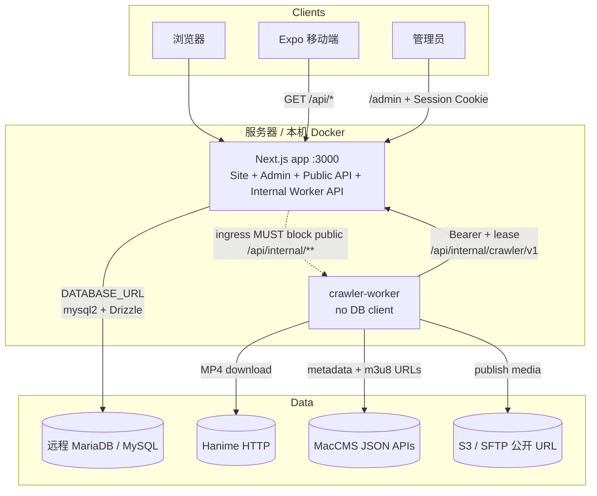
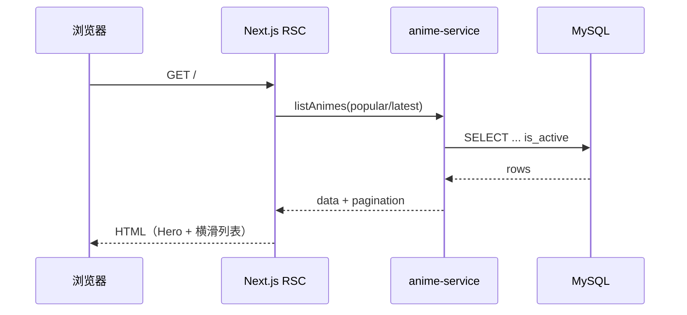
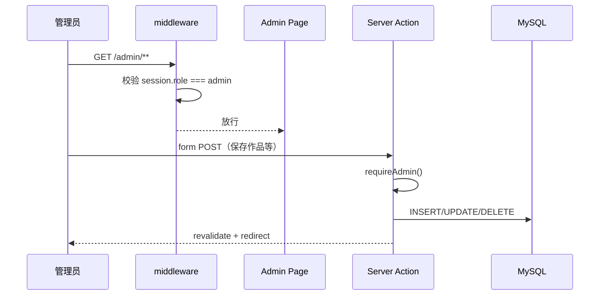
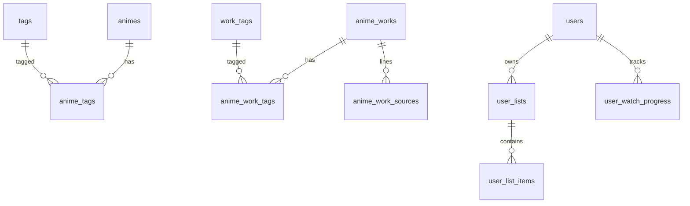

# AnimeStream 架构说明

## 1. 系统概览

AnimeStream 是单进程 **Next.js 15（App Router）** 应用，同时提供：

- 公网站点（**里番** + **动漫**双片库、搜索、播放、进度、片单）
- 管理后台（`/admin`：内容、用户、系统设置、爬虫控制面、存储、播放器）
- 公开 REST API（`/api/*`，供 Web 与移动端）
- Worker 控制面（`/api/internal/crawler/v1/**`，仅内网）

业务数据存放在**远程 MySQL / MariaDB**，Docker Compose **不**包含数据库容器；可选 `crawler-worker` 通过 profile 启动。



## 1.1 爬虫控制面

- 后台：`/admin/crawler/**`（模板、调度、任务、Worker、YAML 导入）
- Worker API：`/api/internal/crawler/v1/**`（见 `docs/api/crawler-internal-openapi.yaml`）
- 运行时：`crawler_worker/`（无 PyMySQL / DATABASE_URL）
- **MacCMS 模式**：只提交外链与元数据到 `anime_works`（+ `work_tags` / 线路 JSON），**不**下载、**不**要求 S3/SFTP
- **Hanime 模式**：下载 progressive **MP4**（无 ffmpeg/HLS 转封装）→ `media/reserve` → 上传已激活 S3/SFTP → 公开 URL 写入 `animes`（+ `tags`）
- 数据流：Worker **无**数据库凭据；App 校验租约并在事务中更新 catalog、来源映射和任务条目
- 控制面核心表 + 版本化存储（`storage_profiles*`）+ 媒体预留（`crawler_media_uploads`）；调度可绑定存储
- 遗留直写脚本 `scripts/production_crawler.py` / `unified_crawler.py` / `crawler_config.py` **已物理删除**
- 旧爬虫与应用共用同一 MySQL 用户时**不会** DROP 该账号（避免拖垮主站）；凭据已从 `production_config.yml` 清空。若存在独立 `CRAWLER_DB_USER`，用 `node scripts/revoke-legacy-crawler-db.mjs` 撤销

## 2. 运行时职责划分

| 层 | 路径 / 模块 | 职责 |
|----|-------------|------|
| 前台页面 | `app/(site)/**` | RSC 拉取列表/详情，Client 组件负责轮播与分页交互 |
| 后台页面 | `app/admin/**` | Server Actions 写库；middleware 校验 `role=admin` |
| 公开 API | `app/api/**` | 只读目录 + 登录用户进度/片单；`/api/media/proxy` 同源 HLS 代理 |
| 里番目录 | `lib/server/catalog/**` + `lib/anime-service.ts` | `animes` / `tags` 列表、详情、推荐 |
| 动漫目录 | `lib/server/works/**` | `anime_works` / `work_tags` / 线路分集 |
| 播放器 | `components/art-player.tsx` 等 | 里番 ArtPlayer；动漫解析 iframe 或 ArtPlayer+proxy |
| 持久化 | `lib/db.ts` + schema | 连接池、重试、Drizzle / 手写 SQL 迁移 |
| 鉴权 | `lib/auth.ts` + `middleware.ts` | bcrypt + iron-session Cookie |
| 系统设置 | `lib/server/system/**` | 注册/SMTP/Turnstile/播放器广告与线路解析 |
| 观看进度 | `user_watch_progress` + `/api/me/watch-progress*` | 登录同步；游客 localStorage 合并 |
| 片单 | `user_lists` / `user_list_items`（权威） | 收藏/想看/在看/已看完/自定义；`user_favorites` 只读回填 |
| 会话 | iron-session + `users.session_version` | 改密/重置后旧 cookie 失效 |
| 认证限流 | 进程内 AuthRateLimiter | 登录/注册/忘记密码 IP+邮箱窗口 |
| 产品事件 | `user_events` | 播放起止与里程碑（分析用，非审计） |
| 媒体源预留 | `media_sources` | 自 `animes.video_url` 回填 primary |
| 对象存储配置 | `storage_profiles*` + Worker env 密钥 | Hanime 发布目标；密钥不入库 |

## 3. 请求数据流

### 3.1 前台首页



### 3.2 管理后台写操作



### 3.3 移动端

移动端（`mobile/`）不经过 Next 页面渲染，直接请求：

- `GET /api/animes`
- `GET /api/animes/:id`
- `GET /api/animes/:id/similar`
- `GET /api/tags`

与公网站共享同一 MySQL 数据源与业务规则（如上架过滤、相似推荐）。

## 4. 数据模型

双片库**分表**，采集与前台均不混写：

| 片库 | 主表 | 标签 | 媒体 |
|------|------|------|------|
| 里番 | `animes` | `tags` / `anime_tags` | 托管 MP4 公开 URL（Hanime→S3/SFTP） |
| 动漫 | `anime_works` | `work_tags` / `anime_work_tags` | 外链 m3u8/直链 + `play_lines_json` |



### 表职责

| 表 | 说明 |
|----|------|
| `animes` | 里番元数据、封面、剧照、视频 URL、播放量、上下架 |
| `tags` / `anime_tags` | 里番标签 |
| `anime_works` | 动漫外链元数据、演职、`stream_url`、`play_lines_json` |
| `work_tags` / `anime_work_tags` | 动漫标签 |
| `anime_work_sources` | 线路/来源映射（若使用） |
| `users` | 账号；`session_version` 用于改密后踢会话 |
| `user_lists` / `user_list_items` | 片单与收藏（权威） |
| `user_favorites` | 历史表，只读回填到系统收藏片单 |
| `user_watch_progress` / `user_events` | 观看进度与产品事件 |
| `password_reset_tokens` | 忘记密码令牌（哈希存储） |
| `system_settings` | 注册/SMTP/Turnstile/播放器等 JSON 配置 |
| `media_sources` | 多源预留（自 `video_url` 回填） |
| `crawler_profiles` / `crawler_schedules` | 采集模板与调度（调度可绑存储） |
| `crawler_jobs` / `crawler_job_attempts` | 任务状态、租约与重试历史 |
| `crawler_job_items` / `crawler_job_events` | 采集条目和结构化日志 |
| `crawler_operation_receipts` | 并发安全的幂等回执 |
| `crawler_workers` | Worker 身份、令牌摘要、能力与心跳 |
| `anime_sources` | 来源 ID → 里番作品 ID 映射 |
| `storage_profiles` / `storage_profile_versions` | S3/SFTP 非密钥配置与激活版本 |
| `crawler_media_uploads` | 媒体预留 / 上传生命周期 |

定义见 `lib/schema.ts` 与 `drizzle/migrations/`（`0001`–`0016`）。管理员初始化见 `scripts/seed-admin.ts`。

## 5. 鉴权与安全

| 项 | 实现 |
|----|------|
| 会话 | Cookie `animestream_session`（iron-session，HttpOnly，SameSite=Lax） |
| 密码 | bcryptjs，cost ≥ 10 |
| 后台门禁 | `middleware.ts` 拦截 `/admin/*`（除 `/admin/login`） |
| 写操作 | Server Action 内再次 `requireAdmin()` |
| 会话密钥 | `SESSION_SECRET` ≥ 32 字符；生产 HTTPS Cookie `secure` |
| 字段加密 | `APP_ENCRYPTION_KEYRING` + `APP_ENCRYPTION_CURRENT_KEY_ID`（AES-GCM；SMTP/Turnstile/爬虫密钥信封） |
| 密钥存放 | 仅 `.env` / 服务器环境，**禁止提交 Git** |
| 内网 API | `/api/internal/crawler/**` 使用 Worker Bearer；**必须**由反代对公网 403 |
| 媒体代理 | `/api/media/proxy` 仅代理合法外链 HLS，带 SSRF 防护 |

公开目录 API 多为**匿名只读**；`/api/me/*` 需登录会话。Worker 使用机器令牌，非用户 Bearer。

## 6. 可靠性设计

远程 MySQL 可能出现空闲断连（`ECONNRESET`）：

- 连接池：`enableKeepAlive`、限制连接数与空闲回收（`lib/db.ts`）
- 业务查询：`withDbRetry` 对瞬态错误重试（`listAnimes` / 详情 / 相似等）
- 健康检查：
  - `GET /api/live` — 进程存活（**Compose healthcheck**）
  - `GET /api/ready` — 含 `SELECT 1`
  - `GET /api/health` — 兼容旧探针

## 7. 部署拓扑

```text
Internet
   │
   ▼
[反向代理 必须 TLS：nginx/Caddy]
   │  屏蔽 /api/internal/crawler/**
   ▼
docker compose:
  app              Next standalone :3000（默认）
  crawler-worker   profile "worker"（可选，无 DB）
   │
   ├── app DATABASE_URL ──► 远程 MySQL
   └── worker ──HTTP──► app:3000/api/internal/crawler/v1
                 └──► S3/SFTP（Hanime 媒体，密钥仅 Worker env）
```

- 见 `docker-compose.yml`；完整步骤 [deployment.md](./deployment.md)
- App 镜像：`Dockerfile`（standalone）；Worker：`Dockerfile.worker`（无 ffmpeg）

## 8. 仓库结构（生产路径）

```text
anime-web/
├── app/                 # Next 路由（site + admin + api）
├── components/          # UI / ArtPlayer / 播放面板
├── lib/                 # 领域服务、db、系统设置、爬虫控制面
├── crawler_worker/      # Python Worker（无 DATABASE_URL）
├── drizzle/             # core + migrations 0001–0016
├── scripts/             # seed、迁移、worker 运维
├── mobile/              # Expo 客户端（独立构建）
├── docs/                # 本套文档
├── Dockerfile
├── Dockerfile.worker
├── docker-compose.yml
└── .env.example
```

## 9. 播放链路（摘要）

| 路径 | 播放器 | 媒体 |
|------|--------|------|
| `/watch/{id}` 里番 | ArtPlayer | 托管 MP4；可选片头/暂停广告；进度由 WatchPlayer 合并 |
| `/works/{id}` 动漫 | 线路匹配 → 解析 iframe；否则可选 ArtPlayer | 外链；HLS 可经 `/api/media/proxy` |

广告与线路解析配置存 `system_settings.player`，经 `getPublicPlayerConfig()` 下发前台。

## 10. 扩展边界（当前非目标）

- Compose 内嵌 MySQL
- 管理 API 的独立公网 Bearer
- Worker 多令牌轮换历史（当前每节点一个活动令牌）
- 将 MacCMS 媒体下载进本站存储（设计为外链 only）
- 广告素材 CDN 中转（广告 URL 由浏览器直连）

对象存储已用于 **Hanime** 发布；动漫仍为外链。若扩展上述边界，应先更新本架构文档与 [deployment.md](./deployment.md)，再改代码。
