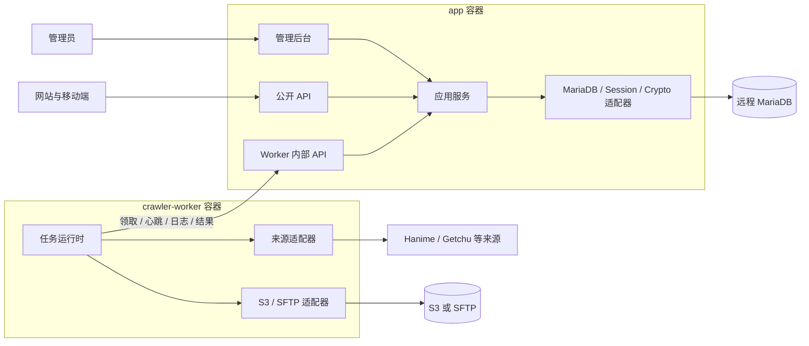
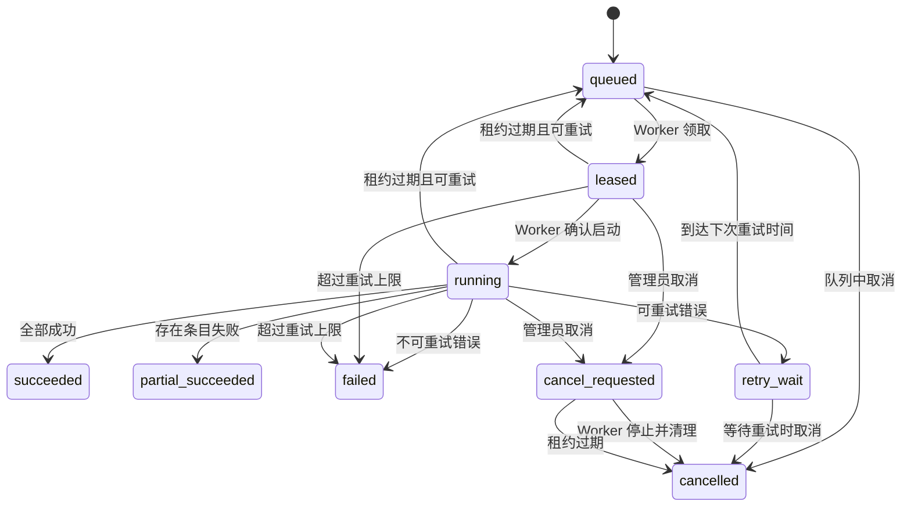

# AnimeStream 后端组件化与爬虫控制面设计

**版本：** 1.0  
**日期：** 2026-07-13  
**状态：** 设计已确认，待实施计划  
**范围：** Next.js 后端、管理后台、MariaDB 数据访问、独立 Python 爬虫 Worker、S3/SFTP 媒体存储

## 1. 概述

AnimeStream 当前由 Next.js App Router 同时提供网站、管理后台和公开 API，并通过 Drizzle/mysql2 访问远程数据库。Python 爬虫仍使用 `production_config.yml` 并直接写入同一数据库。现有结构能够运行，但公共查询、管理写入、认证、数据库重试和爬虫逻辑缺少稳定组件边界，管理写入也没有统一事务。

本设计将系统演进为模块化单体控制面与独立 Worker 数据面：Next.js 后端成为配置、调度、权限、任务状态和业务数据写入的唯一控制面；Python Worker 不再持有数据库凭据，只通过版本化内部 API 领取任务、上报日志和提交结果。媒体下载目标由后台配置，首期支持 S3 兼容对象存储与 SFTP。

## 2. 设计目标

- 建立清晰的领域、应用、端口和基础设施边界。
- 保持现有网站、移动端和公开 API 响应兼容。
- 将所有爬虫参数从 `production_config.yml` 迁移到管理后台。
- 支持后台手动任务与可视化定时任务。
- 保存任务、条目、进度、错误、日志和审计信息。
- 支持多个命名 S3/SFTP 存储配置。
- 爬虫结果只通过后端校验和事务写入 MariaDB。
- 支持配置版本、任务快照、租约、取消、重试和崩溃恢复。
- 彻底删除 D1 配置和爬虫数据库直写能力。
- 为后续来源适配器、对象存储、队列和多 Worker 扩展预留稳定接口。

## 3. 非目标

- 本阶段不拆分独立的 Catalog、Identity 等微服务。
- 第一阶段不引入 Redis、BullMQ、Kafka 等队列基础设施。
- 不改变现有 `/api/animes`、`/api/tags` 等公开 API 主体结构。
- 不在 Worker 中保留生产数据库账号作为回退路径。
- 不直接执行 `drizzle-kit push` 修改生产 MariaDB。
- 不在本设计阶段修改代码、数据库或部署环境。

## 4. 已确认的关键决策

| 决策 | 结论 |
|---|---|
| 架构形态 | Next.js 模块化单体控制面 + 独立 Python Worker |
| 任务控制 | MariaDB 任务表 + Worker 轮询内部 API |
| 队列 | 第一阶段不引入 Redis |
| 数据写入 | 仅后端可写 MariaDB，Worker 无数据库凭据 |
| 配置事实源 | 后台数据库配置与不可变版本 |
| 定时任务 | 手动、间隔、每日、每周和高级 Cron |
| 媒体存储 | 命名 S3/SFTP 配置，可按爬虫模板选择 |
| 密钥查看 | 管理员登录后点击小眼睛直接查看，不做二次验证 |
| 密钥保护 | AES-256-GCM 加密、独立查看接口、禁止缓存、审计和日志脱敏 |
| 兼容策略 | 保留现有服务门面与公开 API，渐进迁移 |
| 数据库 | 以生产 MariaDB 11.4 实际结构为基线 |

## 5. 系统上下文与容器



### 5.1 app 容器

- 提供网站、移动端兼容 API 和管理后台。
- 保存爬虫模板、配置版本、密钥、存储配置和调度规则。
- 创建、发放、取消、重试和恢复任务。
- 校验 Worker 提交的数据并执行目录数据事务。
- 记录任务事件、管理员操作和密钥查看审计。
- 是唯一拥有生产 MariaDB 写权限的运行组件。

### 5.2 crawler-worker 容器

- 使用机器令牌从后端领取任务。
- 根据任务快照执行来源抓取、媒体下载和上传。
- 上报心跳、进度、日志、条目结果与最终状态。
- 不持有数据库凭据，不直接操作 Docker API。
- 存储密钥仅在当前任务进程内存中使用，不落盘。

### 5.3 外部依赖

- MariaDB：业务数据、控制面状态和审计数据。
- S3/SFTP：视频、封面和剧照媒体。
- 外部来源：由 Worker 的来源适配器访问。

## 6. 后端组件结构

目标目录：

```text
lib/server/
├── catalog/
│   ├── domain/
│   ├── application/
│   └── ports/
├── crawler/
│   ├── domain/
│   ├── application/
│   └── ports/
├── identity/
│   ├── domain/
│   ├── application/
│   └── ports/
├── operations/
├── infrastructure/
│   ├── database/
│   ├── auth/
│   ├── crypto/
│   ├── logging/
│   └── media/
└── composition/

crawler_worker/
├── sources/
├── media/
├── transport/
├── runtime/
└── models/
```

### 6.1 Catalog 组件

| 服务 | 职责 |
|---|---|
| `CatalogQueryService` | 列表、详情、标签、推荐和 sitemap 查询 |
| `CatalogCommandService` | 作品保存、删除、上下架和标签管理 |
| `CatalogIngestService` | 校验并构造待提交的目录聚合，不直接控制跨组件事务 |
| `CatalogReadRepository` | 公共及管理读取端口 |
| `CatalogAdminRepository` | 聚合写入端口 |
| `CatalogUnitOfWork` | 管理端动漫、标签等 Catalog 内部写操作的事务边界 |
| `MediaUrlResolver` | 将媒体资产解析为稳定公开 URL、CDN URL 或私有 S3 短期跳转 |

### 6.2 Crawler Control 组件

| 服务 | 职责 |
|---|---|
| `CrawlerConfigService` | 模板、版本、字段校验和 YAML 导入 |
| `StorageConfigService` | S3/SFTP 配置、测试连接和版本管理 |
| `SecretService` | 加密、查看、修改、版本和审计 |
| `CrawlerScheduleService` | 调度规则、下次运行时间和到期任务生成 |
| `CrawlerJobService` | 创建、领取、租约、心跳、取消、重试和完成 |
| `CrawlerLogService` | 结构化事件、批量日志、统计和脱敏 |
| `CrawlerResultService` | 条目接收、媒体验证和跨组件提交协调 |
| `IngestionUnitOfWork` | 在同一 MariaDB 事务内提交幂等收件箱、Catalog 数据、任务条目状态和确认结果 |

### 6.3 Identity 组件

- `IdentityService`：登录、用户状态、角色和权限。
- `UserRepository`：用户持久化端口。
- `SessionPort`：iron-session 适配端口。
- `SessionConfig`：middleware 与 Node.js 服务端共享的 Cookie 名称、选项、schema 版本和密钥轮换配置。
- `PasswordHasher`：bcrypt 适配端口。
- `WorkerCredentialService`：机器令牌创建、轮换、撤销和校验。

middleware 只做已签名会话和 `role=admin` 的粗粒度门禁。管理页面、Server Action 和敏感 API 必须继续通过 `IdentityService` 查询用户是否存在、启用且仍为管理员。Cookie 名称、`secure/httpOnly/sameSite/maxAge` 在 middleware 与服务端必须完全一致；会话 schema 或密钥滚动升级时同时支持当前和上一版本，避免部署期间批量登出。

### 6.4 Operations 组件

- 应用存活与依赖就绪检查。
- Worker 在线状态和版本能力。
- 结构化日志、请求 ID、任务 ID 和条目 ID。
- 管理员、Worker 和密钥操作审计。
- 日志保留、临时媒体和孤儿媒体清理任务。

### 6.5 依赖方向

```text
Next Route / Server Action / RSC
              ↓
        Application Service
              ↓
       Domain + Port Interface
              ↑
 MariaDB / iron-session / bcrypt / crypto adapter
```

- 领域与应用层不得导入 Next.js、Drizzle、mysql2 或 iron-session。
- Route Handler、Server Action 和 RSC 仅负责传输适配和页面行为。
- `app/admin/**` 不得直接访问 `db` 或表对象。
- `lib/anime-service.ts` 与 `lib/auth.ts` 初期作为兼容门面转发到新组件，调用方迁移完成后删除。

## 7. 管理后台信息架构

| 页面 | 功能 |
|---|---|
| `/admin/crawler` | 总览、Worker 在线状态、近期任务和错误统计 |
| `/admin/crawler/profiles` | 爬虫模板列表、启停、复制和版本历史 |
| `/admin/crawler/profiles/[id]` | 可视化配置字段、密钥查看和存储选择 |
| `/admin/crawler/schedules` | 手动、间隔、每日、每周、Cron 和重叠策略 |
| `/admin/crawler/jobs` | 任务筛选、状态、来源、进度和批量操作 |
| `/admin/crawler/jobs/[id]` | 配置快照、条目、日志、错误、重试和取消 |
| `/admin/crawler/storage` | S3/SFTP 配置、测试连接和测试上传 |
| `/admin/crawler/workers` | Worker 心跳、版本、能力和当前任务 |
| `/admin/crawler/import` | 导入 `production_config.yml` 并预览映射 |
| `/admin/audit` | 配置、密钥、任务和管理员操作审计 |

后台字段由版本化配置 schema 与字段元数据驱动。后端始终使用同一 schema 校验导入、表单保存、任务快照和 Worker 能力，防止 UI 与运行时参数漂移。

## 8. production_config.yml 迁移

### 8.1 映射规则

| 原配置 | 新归属 | 处理 |
|---|---|---|
| `crawl.base_url` | 来源配置 | 保留 |
| `crawl.date_filter` | 来源过滤 | 保留，使用年份/月多选 |
| `crawl.search` | 来源搜索参数 | 保留 |
| `crawl.quality_priority` | 媒体选择策略 | 保留并支持排序 |
| `crawl.skip_keywords` | 内容过滤 | 保留 |
| `download.enable_*` | 媒体开关 | 保留 |
| `download.chunk_size` | 下载参数 | 保留并校验范围 |
| `download.max_concurrent` | 下载并发 | 迁移为唯一规范字段 `downloadConcurrency` |
| `download.clean_filename` | 路径策略 | 保留 |
| `download.organize_by_date` | 对象路径模板 | 保留，用于生成日期目录层级 |
| `download.download_dir` | 存储配置 | 转换为对象路径模板，不作为最终本地目录 |
| `download.temp_dir` | Worker 临时空间 | 保留为受限制的相对目录配置 |
| `web_access.domain_prefix` | 存储公开地址 | 转换为存储配置 `publicBaseUrl` |
| `web_access.base_path` | 存储路径 | 转换为存储前缀或路径模板 |
| `network.proxy` | 网络配置与密钥 | 保留，代理凭据加密 |
| `network.timeout` | 网络参数 | 保留 |
| `network.max_retries` | 重试策略 | 保留 |
| `network.retry_delay` | 重试策略 | 转换为退避基数 |
| `network.user_agent` | 来源请求头 | 保留 |
| `selenium.headless/disable_dev_shm/implicit_wait/page_load_timeout` | 浏览器参数 | 保留并按 Worker 能力校验 |
| `selenium.no_sandbox` | 浏览器安全参数 | 可导入显示，但生产配置硬拒绝 `true`；仅本地测试环境允许 |
| `strategy.*` | 任务策略 | 保留并修复现有未生效参数 |
| `getchu.*` | Getchu 来源扩展 | 保留 |
| `logging.level` | 任务日志策略 | 保留 |
| `logging.console_output` | Worker 诊断 | 保留 |
| `logging.file/format/max_size/backup_count` | 结构化日志 | 不按文件语义迁移，由事件表、保留策略和容器 stdout 替代 |
| `performance.max_concurrent_downloads` | 下载并发旧别名 | 与 `download.max_concurrent` 同时存在且不同则预览告警，以 `download.max_concurrent` 为准 |
| `performance` 其他字段 | Worker 运行策略 | 保留，容器硬限制仍由部署配置控制 |
| `app.*` | 构建信息 | 只读展示，不可编辑 |
| `database.*` | 无 | 不迁移，Worker 禁止连接数据库 |
| `d1_sync.*` | 无 | 旧栈字段，明确废弃 |

### 8.2 导入流程

1. 管理员上传或粘贴现有 YAML。
2. 后端使用安全 YAML 解析器生成预览，不立即写入；文件最大 1 MiB、嵌套最多 20 层，拒绝自定义 tag、对象构造和 alias。
3. 预览分为已映射、已转换、已废弃、缺失和校验失败。
4. 密钥字段使用掩码展示，可点击小眼睛查看原值。
5. 旧 YAML 只能推导路径和公开域名，不能自动推导 S3 Endpoint/Bucket 或 SFTP Host/User/指纹；管理员必须选择驱动、补齐字段并通过测试任务。
6. 管理员确认后创建爬虫模板版本、密钥版本和已验证的存储配置版本。
7. 导入完成后，数据库配置成为运行时事实源。
8. YAML 只允许作为迁移输入或脱敏模板导出，不再被 Worker 直接读取；普通导出永不包含明文密钥。
9. 可恢复备份依赖数据库备份与加密 keyring 备份，不通过明文 YAML 完成。

### 8.3 配置快照

- 修改模板会创建新版本，不覆盖旧版本。
- 启动任务时固定爬虫版本、存储版本和密钥版本。
- 运行中任务不受后续后台修改影响。
- Worker 领取时只获得当前任务所需的解密值。

## 9. S3 与 SFTP 存储

### 9.1 S3 配置

- Endpoint、Region、Bucket、路径前缀和公开域名。
- Access Key、Secret Key 和可选 Session Token。
- Path Style 开关，兼容 AWS S3、MinIO 和其他 S3 服务。
- 支持连接测试、测试上传、读取校验和删除测试对象。
- 优先通过 `S3CredentialBroker` 获取按任务、Bucket 前缀和有效期限制的 STS 凭据或预签名操作。
- 不支持临时授权的供应商可使用专用长期账号作为兼容回退，但必须限制到单一 Bucket/前缀，并在后台明确显示风险。

### 9.2 SFTP 配置

- Host、Port、Username、根目录和公开域名。
- 密码或私钥认证，可配置私钥口令。
- 要求保存主机指纹并验证，禁止默认静默接受未知主机。
- 支持连接测试、测试上传、重命名和删除。
- SFTP 必须使用专用账号、chroot/目录级限制、无 Shell 权限和最小读写权限。

### 9.3 发布语义

- Worker 上传前必须从后端预留 staging/final 对象键；staging key 固定包含 job、attempt 和 reservation ID。
- Worker 先写入任务专属 staging 路径。
- 完成后校验文件大小、内容类型和 SHA-256。
- S3 通过临时对象到正式对象的受控发布完成。
- SFTP 通过同文件系统原子重命名完成。
- Worker 回传存储配置版本、对象键、大小、类型和校验值。
- 最终公开 URL 由后端依据受信任存储配置生成，不接受任意 Worker URL。
- `crawler_media_uploads` 保存预留键和生命周期；即使 Worker 在发布后、上报前崩溃，对账任务也能定位并清理对象。

### 9.4 交付地址与私有存储

- 存储配置明确声明 `public`、`cdn` 或 `private` 交付模式。
- `public/cdn` 模式要求提供稳定 `publicBaseUrl`，可以继续写入现有 `animes.*_url` 字段。
- 私有 S3 使用稳定的同源媒体路由，由 `MediaUrlResolver` 在请求时生成短期签名 URL 或重定向；不得把短期签名 URL 永久写入数据库。
- SFTP 若没有对应的 HTTPS/CDN 公开映射，只能作为归档存储，不能直接作为现有播放器的媒体来源。

### 9.5 存储测试任务

- S3/SFTP 适配器只实现于 Worker，app 不重复实现存储客户端。
- 后台保存草稿配置后创建 `storage_test` 类型任务，由兼容 Worker 执行连接、上传、校验、发布和删除。
- 只有测试成功的版本可以激活给正式爬虫模板使用。
- 测试任务使用独立临时前缀、超时和完整审计记录。

## 10. 数据模型

现有业务表首期保持兼容。实施前先导出生产 MariaDB DDL，使 Drizzle schema 与主键、日期类型、默认值、外键、唯一约束和索引一致。

### 10.1 新控制表

| 表 | 职责 |
|---|---|
| `crawler_profiles` | 模板身份、启停和当前版本 |
| `crawler_profile_versions` | 不可变普通配置和 schema 版本 |
| `storage_profiles` | 存储身份、驱动和启停 |
| `storage_profile_versions` | 不可变 S3/SFTP 普通配置 |
| `secrets` | 密钥身份和所属范围 |
| `secret_versions` | 加密值、密钥版本、nonce 和认证标签 |
| `crawler_schedules` | 调度表达式、时区、下次执行和重叠策略 |
| `crawler_jobs` | 任务快照、状态、租约、进度和重试 |
| `crawler_job_attempts` | 每次领取/重试的 Worker、租约哈希、起止时间和结果 |
| `crawler_job_items` | 每个来源条目的处理阶段和结果 |
| `crawler_job_events` | 状态、进度、日志和错误事件 |
| `crawler_operation_receipts` | 内部写操作的幂等收件箱、请求哈希及可重复返回的确认结果 |
| `crawler_media_uploads` | 上传前预留的 staging/final 对象键、归属 attempt 和对账状态 |
| `crawler_workers` | Worker 身份、版本、能力和心跳 |
| `worker_credentials` | 机器令牌哈希、范围、轮换和撤销 |
| `audit_logs` | 管理员和 Worker 操作审计 |
| `anime_sources` | `source + source_id` 幂等映射 |
| `media_assets` | 存储对象、URL、校验值和生命周期 |

`crawler_jobs.kind` 首期支持 `crawl`、`storage_test` 和 `cleanup`。不同类型共享租约、心跳、日志和审计机制，但使用各自的配置 DTO 与结果校验器。

### 10.2 兼容字段

- `media_assets` 是新的媒体事实记录。
- 成功提交媒体后，同一事务继续更新现有 `animes.video_url`、`cover` 或 `fanart` 字段。
- 网站和移动端无需立即理解 `media_assets`。

### 10.3 幂等约束

- `crawler_jobs(schedule_id, scheduled_for)` 唯一。
- `crawler_job_events(job_id, attempt_id, sequence)` 唯一。
- `crawler_job_items(job_id, source, source_id)` 唯一。
- `anime_sources(source, source_id)` 唯一。
- `crawler_operation_receipts(operation_scope, idempotency_key_hash)` 唯一，并保存 job/item 范围、规范化 `request_hash` 与确认响应。
- 结果提交和完成请求必须携带幂等键。

`CrawlerResultService` 是爬虫结果提交的唯一应用层入口。它调用 `CatalogIngestService` 完成业务校验，再由 `IngestionUnitOfWork` 在一个事务中写入收件箱、动漫、标签、来源映射、媒体资产、兼容 URL、任务条目状态和确认结果。若事务已提交但响应丢失，Worker 重试时从 `crawler_operation_receipts` 返回原确认，不重复写业务数据；相同操作范围和幂等键但 job/item 或 `request_hash` 不同必须返回 `RESULT_CONFLICT`，不能静默复用旧确认。任务完成、失败等其他内部写操作也在该表保存确认结果。

### 10.4 MariaDB 物理类型规则

- 外部 `source_id` 保存规范化原值，并使用二进制排序规则；同时保存 `SHA-256(source + NUL + source_id)` 的 `BINARY(32)` 唯一哈希。
- 幂等键和机器令牌只保存 `BINARY(32)` 哈希，避免大小写不敏感排序规则造成误合并。
- 租约令牌也只保存 `BINARY(32)` 哈希，并绑定 `job_id + attempt_id + worker_id + expires_at`；校验使用常量时间比较。
- 配置和任务快照使用规范化 JSON 文本，并增加 `JSON_VALID` 约束；不依赖 MySQL 原生二进制 JSON 特性。
- 密钥密文、nonce、认证标签和哈希使用二进制列，不经过字符集转换。
- 所有时间以 UTC DATETIME 保存，业务时区只用于调度计算和展示。

## 11. 任务状态机



- 默认同一模板不并行运行。
- 每个调度可选择跳过、排队或允许并行。
- Worker 心跳续租，同时获取取消标记。
- 旧租约失效后，原 Worker 的提交必须返回 `LEASE_LOST`。
- `continueOnError=true` 且至少一个条目失败时，最终状态为 `partial_succeeded`，不能标记为完全成功。
- `succeeded`、`partial_succeeded`、`failed` 和 `cancelled` 均为不可重新打开的终态。
- 手动重试会创建新任务，设置 `retry_of_job_id` 并默认复制原配置快照；使用最新配置应通过“基于当前模板新建任务”执行。
- 取消与完成使用状态条件更新：取消先提交则拒绝完成；完成先提交则后续取消返回冲突。

## 12. 调度设计

- 管理后台支持立即运行、固定间隔、每日、每周和高级 Cron。
- 管理员选择业务时区，后端以 UTC 保存计算结果。
- Worker 调用领取接口时，后端在同一事务中按补跑策略物化到期计划点并发放租约。
- `(schedule_id, scheduled_for)` 唯一约束防止多 Worker 重复生成。
- 手动创建或已物化的任务在无 Worker 时保持排队；尚未物化的到期计划点保存在 schedule 的 `next_run_at`/misfire 状态中，后台显示为“逾期待领取”。
- 第一个兼容 Worker claim 时按 misfire 策略物化逾期计划点，计划时间不会静默丢失。
- Cron 使用标准五字段语法，不支持秒字段；时区使用 IANA 名称。
- 夏令时跳过的本地时间不补跑，重复的本地时间只按其 UTC 计划点运行一次。
- 停机错过任务默认只补最近一次，可选择跳过或有限补跑；单次恢复最多补 3 个计划点，防止任务风暴。
- 模板设置 `maxActiveJobs`，默认 1；调度的“允许并行”不能突破模板并发上限。
- “跳过”表示已有活动任务时记录一次 skipped 调度事件；“排队”创建任务等待；“允许并行”在并发上限内立即排队领取。

## 13. 内部 Worker API

基础路径：`/api/internal/crawler/v1`。

```text
POST /workers/register
POST /workers/{workerId}/heartbeat
POST /jobs/claim
POST /jobs/{id}/start
POST /jobs/{id}/heartbeat
POST /jobs/{id}/events:batch
POST /jobs/{id}/media:reserve
POST /jobs/{id}/credentials:refresh
POST /jobs/{id}/items:commit
POST /jobs/{id}/complete
POST /jobs/{id}/fail
```

### 13.1 鉴权

- Worker 使用 `Authorization: Bearer <machine-token>`。
- 数据库只保存机器令牌哈希。
- 令牌支持创建、轮换、撤销和范围限制。
- 机器令牌主体绑定固定 `worker_id`；URL 或请求体中的 Worker 身份不匹配时返回 403。
- 领取任务后返回单独租约令牌，后续任务请求必须同时携带。
- 后端只保存租约令牌哈希，并校验其绑定的 job、attempt、Worker 和过期时间；旧 attempt 的租约不能用于新 attempt。
- Worker 通过 Compose 服务地址访问该路径，但内部 API 与公开 API 共享 Next.js 监听端口，不能仅靠 Docker 网络声明为私有。
- 生产入口必须在反向代理或 ingress 层拒绝公网 `/api/internal/crawler/**`，并将 app 宿主端口绑定到 loopback 或受防火墙保护的地址。
- 机器令牌仍是强制应用层认证；跨主机部署必须再使用 TLS，网络 ACL 不能替代令牌认证。
- 无效或无法识别的机器令牌返回 HTTP 401 `WORKER_TOKEN_INVALID`，已撤销令牌返回 HTTP 401 `WORKER_TOKEN_REVOKED`，scope 或 `worker_id` 不匹配返回 HTTP 403 `WORKER_FORBIDDEN`。
- `credentials:refresh` 仅接受有效机器令牌和当前租约令牌，并只返回该任务、该存储前缀的新短期 S3 权限；撤销的 secret version 不可刷新。

### 13.2 能力协商

Worker 注册或领取时上报：

- Worker 版本。
- 支持的来源适配器。
- 支持的存储驱动。
- 支持的配置 schema 版本。
- 最大并发和当前负载。

后端只把兼容任务发给具备对应能力的 Worker。

- Worker 启动时调用注册接口，并在空闲期间每 30 秒发送 Worker 级心跳。
- `jobs/claim` 可以长轮询最多 20 秒，但不能替代 Worker 级在线心跳。
- Worker 心跳更新版本、能力、当前负载和当前任务，后台据此判断在线状态。

### 13.3 日志与结果

- 日志在每个 `attempt_id` 内使用连续 sequence 批量上报，重新租赁不会复用旧 attempt 序列。
- 任务事件和条目结果均使用幂等键。
- Worker 不提交任意 SQL、表名或数据库字段。
- 条目结果使用稳定 DTO，由 `CrawlerResultService` 转换为 Catalog 命令。
- 单次事件批次最多 100 条且请求体最多 256 KiB；超限返回稳定错误码，Worker 必须拆分重试。

## 14. 端到端数据流

### 14.1 保存配置

1. 管理员提交可视化表单。
2. Server Action 只负责表单适配和导航。
3. `CrawlerConfigService` 校验字段、加密密钥并创建新版本。
4. 审计记录保存修改者、目标、时间和字段摘要。

### 14.2 启动与领取任务

1. 手动启动立即创建 `queued` 任务；定时规则在领取时物化到期任务。
2. Worker 调用 `jobs/claim` 并上报能力。
3. 后端原子选择任务、创建 `attempt_id`、写入租约并返回不可变快照。
4. 返回值包含必要的来源密钥以及经凭据代理处理的当前任务存储权限。

### 14.3 下载与媒体上传

1. Worker 抓取来源数据并选择质量。
2. 下载到受限制的临时目录。
3. Worker 在上传前调用 `media:reserve`，后端记录 job、attempt、item、staging key 和 final key。
4. 使用任务指定的 S3/SFTP 适配器上传 staging 对象。
5. 校验大小和 SHA-256 后发布正式对象。
6. Worker 上报预留记录 ID、对象键和元数据。
7. Worker 在上报前崩溃时，对账任务可依据 `crawler_media_uploads` 精确检查和清理 staging/final 对象。

### 14.4 业务提交

1. 后端验证租约、DTO、来源身份、对象路径和配置版本。
2. 先按操作范围和幂等键读取 `crawler_operation_receipts`；job/item 范围及请求哈希相同则返回原确认，不同则返回 `RESULT_CONFLICT`。
3. 按 `source + source_id` 查找或创建来源映射。
4. `IngestionUnitOfWork` 在一个事务内写入收件箱、动漫、标签、媒体资产、兼容 URL、任务条目状态和确认结果。
5. 事务提交后返回幂等确认；响应丢失时重复请求不会重复写业务数据。

### 14.5 取消与恢复

- `queued` 和 `retry_wait` 任务取消后直接进入 `cancelled`。
- `leased` 和 `running` 任务取消后进入 `cancel_requested`。
- Worker 从心跳响应读取取消标记，停止领取新条目并清理临时资源。
- `cancel_requested` 时 Worker 崩溃，租约过期后直接转为 `cancelled`。
- 其他运行任务在 Worker 崩溃或网络断开后按重试策略创建新 attempt 并重新排队。
- 手动重试创建关联的新任务，不重新打开终态任务。

## 15. 错误模型

统一错误码：

```text
CONFIG_INVALID
SOURCE_AUTH_FAILED
SOURCE_RATE_LIMITED
SOURCE_UNAVAILABLE
STORAGE_AUTH_FAILED
STORAGE_AUTH_EXPIRED
STORAGE_UNAVAILABLE
SECRET_REVOKED
RESULT_INVALID
RESULT_CONFLICT
LEASE_LOST
WORKER_INCOMPATIBLE
WORKER_TOKEN_INVALID
WORKER_TOKEN_REVOKED
WORKER_FORBIDDEN
BATCH_TOO_LARGE
DATABASE_TRANSIENT
CANCELLED
INTERNAL_ERROR
```

### 15.1 重试策略

- 网络超时、限流和临时存储故障使用指数退避与随机抖动。
- 配置、认证、权限和数据校验错误不自动重试。
- 只重试只读操作或带幂等键的写入。
- 不再通过匹配 `Failed query` 字符串判断数据库瞬时错误。
- 单条失败是否继续由任务快照中的 `continueOnError` 决定。

### 15.2 API 错误

- 公开 API 继续返回兼容的 `{ error: string }`。
- 可附加 `code` 和 `requestId`，但不删除现有字段。
- 不向客户端返回 SQL、参数、驱动错误或连接信息。
- 内部 API 返回稳定错误码、是否可重试和请求 ID。

## 16. 密钥安全

- 密钥使用 AES-256-GCM 加密，保存 nonce、认证标签和加密密钥版本。
- 主加密 keyring 来自 app 运行环境，不存入数据库；配置包含当前写入 key ID 与仍可解密旧数据的历史 key。
- 每次加密使用密码学安全随机 96-bit nonce，同一 key 下不得复用；AAD 固定包含 `secret_id`、`secret_version` 和所属范围。
- 轮换时先加入新 key 并设为当前写入版本，再后台重加密旧记录；确认没有旧 key 引用并完成备份验证后才能删除旧 key。
- 数据库备份必须与对应 keyring 安全备份配套，否则密钥数据无法恢复。
- 管理员点击小眼睛即可调用独立查看接口，不要求二次验证。
- 查看接口要求管理员会话，响应设置 `Cache-Control: no-store`。
- 查看、复制、修改、Worker 取用和轮换均记录审计。
- 前端默认掩码显示并自动重新隐藏。
- 任务日志、错误、配置预览和审计元数据统一执行密钥脱敏。
- 被撤销的密钥版本不能再用于新任务领取；已排队任务领取时返回 `SECRET_REVOKED`，管理员需基于当前配置创建新任务。
- 临时 S3 凭据过期返回 `STORAGE_AUTH_EXPIRED`，Worker 可在同一有效租约内调用 `credentials:refresh` 重新申请；SFTP 长期凭据必须依赖专用受限账号降低暴露范围。

该直接查看模式降低了维护成本，但管理员会话失窃时风险较高。这是已确认的产品取舍，不能在实现中擅自增加二次验证。

### 16.1 出站网络与 SSRF 防护

- 来源 URL、代理、S3 Endpoint 和 SFTP Host 都必须经过统一 `OutboundPolicy` 校验，测试连接与正式任务使用同一策略。
- 默认只允许 HTTP/HTTPS 和 SFTP 所需协议，拒绝 `file:`、`gopher:` 等本地或非预期协议。
- 默认拒绝 loopback、link-local、云 metadata 地址和私网 CIDR；访问内部 S3/SFTP 必须由管理员显式加入允许的主机/CIDR。
- DNS 解析后再次校验目标 IP，每次重定向都重新执行策略，防止 DNS 重绑定与跳转绕过。
- TLS 证书验证默认强制启用；自定义 CA 作为受审计密钥配置，禁止静默关闭验证。
- SFTP 除网络策略外还必须验证已保存的主机指纹。

## 17. 日志、监控与保留

- 所有请求、任务、条目和日志带 `requestId`、`jobId`、`itemId`。
- 后台展示 Worker 在线状态、版本、能力、当前任务和最近心跳。
- 任务详情展示进度、速率、成功/跳过/失败数量、错误和日志。
- 任务摘要、配置快照和审计记录长期保存。
- 详细日志默认保留 90 天，后台可调整。
- 上传成功但业务提交失败的媒体标记为待清理。
- 定期清理过期详细日志、临时对象和孤儿媒体。

### 17.1 健康检查

- `/api/health`：保留现有公开路径、状态码和数据库就绪响应，继续满足 OpenAPI 与现有运维调用。
- `/api/live`：只检查 app 进程；新增后再将 Docker healthcheck 从 `/api/health` 渐进切换到该端点。
- `/api/ready`：检查 MariaDB、加密密钥和控制面依赖。
- Worker 通过心跳上报运行状态，不对公网开放端口。

## 18. 数据库与迁移安全

生产数据库只读审计显示实际为 MariaDB 11.4，并与当前 `lib/schema.ts` 存在类型、默认值、约束和索引漂移。

实施规则：

- 首先导出并版本化生产 DDL 基线。
- Drizzle schema 必须精确表达现有主键、DATE/DATETIME、默认值、外键和唯一约束。
- 新控制表使用显式、可审查 SQL 迁移。
- 所有迁移先在生产结构副本或影子库验证。
- 生产禁用裸 `db:push`。
- 新表与新字段优先采用加法迁移；清理旧字段必须独立审批。
- Web 数据库连接增加 TLS 支持并配置化连接池。
- 生产 MariaDB 连接必须启用 TLS、校验 CA 链和服务器主机名，禁止 `rejectUnauthorized=false` 或等价跳过验证配置。
- 本地开发可显式使用不加密的 localhost 数据库，但该模式不能在 `NODE_ENV=production` 启动。
- `/api/ready` 必须验证当前数据库会话使用加密连接；未启用或证书校验失败时返回未就绪。

## 19. 测试策略

### 19.1 单元测试

- 任务状态机、租约和取消规则。
- queued/leased/running/retry_wait 取消、取消与完成竞态、终态手动重试和 `partial_succeeded` 判定。
- 调度时间、时区和重叠策略。
- 配置迁移、YAML 映射和 schema 版本。
- 日志脱敏、密钥加解密和路径生成。
- S3/SFTP 对象键与公开 URL 生成。
- YAML 大小、深度、alias、自定义 tag 和恶意输入限制。
- 出站地址策略、DNS 重绑定、重定向和私网 allowlist。

### 19.2 应用服务测试

- 使用内存仓储验证权限、版本、任务和幂等行为。
- 验证管理操作不会绕过应用服务直写数据库。
- 验证 `IngestionUnitOfWork` 将收件箱、Catalog、任务条目和确认结果原子提交。
- 验证相同幂等键同载荷返回原确认、异载荷返回 `RESULT_CONFLICT`，完成/失败请求同样保存操作确认。
- 验证密钥查看响应 `no-store`、审计记录和撤销密钥拒绝领取。

### 19.3 集成测试

- MariaDB 11.4 临时容器验证约束、事务和迁移。
- MinIO 验证 S3 连接、上传、发布和清理。
- 临时 SFTP 容器验证指纹、上传、重命名和删除。
- Worker 内部 API 验证机器令牌、租约和重复请求。
- 并发 Worker claim 只能领取一次；租约过期后的迟到提交必须失败。
- 验证 attempt 级日志序列、事件批次 100 条/256 KiB 限制和重复批次确认。
- 验证私有 S3 URL 解析以及 SFTP 无公开映射时拒绝作为播放源。
- 验证媒体预留后 Worker 崩溃时，存储对账能够发现并清理 staging/final 对象。
- 验证短期 S3 权限刷新、机器令牌 401/403 映射和 workerId 绑定。
- 验证无 Worker 时逾期计划点展示，以及首次 claim 的 misfire 物化上限。
- 验证生产 MariaDB 明文连接或证书校验失败会使 `/api/ready` 失败。

### 19.4 契约与端到端测试

- 先修正 OpenAPI 的 required 字段和状态码，再为每个现有公开端点保存真实黄金响应样本；契约测试同时校验字段存在性、null 语义、状态码和错误结构。
- 旧兼容门面与新应用服务在同一 fixture/测试数据库上执行差分测试，结果必须等价。
- `/api/health`、`/api/live` 和 `/api/ready` 分别覆盖兼容、存活和就绪语义。
- 新增内部 Worker API 契约文档和测试。
- app 与 Worker 覆盖当前和上一协议版本的滚动升级测试，不兼容能力不得领取任务。
- 运行 `app + crawler-worker + MariaDB + MinIO/SFTP` 端到端测试。
- 注入数据库断连、上传失败、重复提交、Worker 崩溃、租约过期和后端重启。

## 20. 渐进迁移计划

1. 导出生产 MariaDB DDL，建立 schema 基线和差异门禁。
2. 为现有公开 API、管理行为和查询规则增加特征测试。
3. 创建组件目录与组合根，保留现有兼容门面。
4. 迁移 Catalog 查询、Identity 和管理写入，补齐事务和统一错误模型。
5. 完成依赖漏洞修复并重新建立安全审计基线。
6. 新增控制面表、Crawler 应用服务、后台页面和内部 API。
7. 实现 S3/SFTP 配置、密钥管理和测试连接能力。
8. 将 Python 脚本迁移为新的 `crawler_worker` 包；旧 PyMySQL 路径仅保留在代码库用于差分，不打入 Worker 镜像、不配置生产凭据且默认不可运行。
9. 导入现有 `production_config.yml`，运行不提交业务数据的影子任务并比较来源解析、媒体选择和 DTO 输出。
10. 影子验收通过后切换正式任务，观察期内允许关闭新爬虫但不重新启用旧生产写入。
11. 确认新路径稳定后撤销爬虫数据库账号，再删除 PyMySQL、`database`、`d1_sync` 和 YAML 运行时读取。
12. 完成故障恢复、性能、日志保留和部署验收。
13. 所有调用方迁移完成后删除 `lib/anime-service.ts`、`lib/auth.ts` 等兼容门面。

## 21. 部署设计

```text
docker compose
├── app
└── crawler-worker

外部依赖
├── MariaDB
└── S3 或 SFTP
```

### 21.1 app 环境

- `DATABASE_URL`
- 数据库 TLS 与连接池配置
- `SESSION_SECRET`
- `APP_ENCRYPTION_KEYRING` 与 `APP_ENCRYPTION_CURRENT_KEY_ID`
- Worker 令牌管理所需的服务端配置

### 21.2 Worker 环境

- `BACKEND_INTERNAL_URL=http://app:3000`
- `CRAWLER_WORKER_ID`
- `CRAWLER_WORKER_TOKEN`

Worker 环境不得包含数据库、S3 或 SFTP 长期凭据。S3 优先由后端按任务签发短期权限；SFTP 或兼容回退凭据只在任务领取响应中下发并保存在内存。

### 21.3 Worker 镜像与运行隔离

- 使用独立 `Dockerfile.worker` 和带哈希锁定的 Python 依赖文件。
- 镜像固定 Chromium 与兼容 Driver 版本，Worker 启动时上报浏览器版本。
- 使用非 root 用户、只读根文件系统、`no-new-privileges`、默认 seccomp 和最小 Linux capabilities。
- Selenium 沙箱在生产强制启用；后台不得保存可供生产 Worker 使用的 `no_sandbox=true` 版本，本地测试环境例外。
- 临时下载目录使用受限 volume/tmpfs，配置磁盘配额、任务目录隔离和启动/结束清理。
- Compose 配置 CPU、内存、PID 和并发上限，`performance.max_memory_mb` 作为 Worker 软限制，容器限制作为硬边界。

### 21.4 网络

- Worker 不发布宿主机端口。
- Worker 使用 Compose 私有网络访问 `http://app:3000/api/internal/crawler/v1`。
- app 与公开 API 共享监听端口，因此生产反向代理/ingress 必须拒绝公网 `/api/internal/crawler/**`；无此规则时不得启用 Worker 控制面。
- app 宿主端口应绑定 loopback 或由防火墙限制，只允许受控入口代理访问。
- app 是唯一连接 MariaDB 的容器。
- S3/SFTP 和远程 MariaDB 连接应启用 TLS 或等效加密通道。

## 22. 兼容承诺

- 保持公开 API 路径、camelCase 字段和分页结构。
- 保持 `/api/health` 的现有路径和数据库就绪响应；`/api/live`、`/api/ready` 仅做加法扩展。
- 保留移动端依赖的 `{ error }` 失败字段。
- 保留 `animes.video_url` 等现有媒体字段。
- 公开 API 兼容以修正后的 OpenAPI、字段必选性和黄金响应样本共同判定，不能仅依赖宽松 TypeScript 可选类型。
- 配置 schema、内部 API 和 Worker 能力均版本化。
- app 在滚动升级期间至少识别当前和上一 Worker 协议版本；不兼容任务不下发。
- 不重新引入 Cloudflare Workers、D1、Vite 或爬虫数据库直写。

## 23. 验收标准

- 管理员可以在后台完整维护原 `production_config.yml` 中仍有效的参数。
- 导入预览明确显示映射、转换、废弃和失败字段。
- 管理员可以直接点击查看爬虫、代理、S3 和 SFTP 密钥。
- 支持手动和定时任务，并可取消、重试和查看历史。
- Worker 无数据库凭据且无法绕过后端写业务数据。
- S3 与 SFTP 均可测试连接、上传、校验和发布。
- 重复任务、重复日志和重复结果不会产生重复业务数据。
- Worker 或 app 重启后任务能通过租约恢复。
- 公开网站、移动端和 API 契约保持兼容。
- 日志不泄露密钥、SQL 或连接信息。
- 公网入口无法访问 `/api/internal/crawler/**`，Worker 机器令牌与租约仍通过应用层校验。
- 生产 Worker 使用浏览器沙箱和受限容器权限，生产 MariaDB 会话通过 TLS 且验证证书。
- 生产 schema 变更使用显式迁移，不执行裸 `db:push`。
- `database`、`d1_sync` 和旧 YAML 运行时路径在切换后删除。

## 24. 设计自审结论

- 文档没有待定占位符，核心路径均有明确决策。
- 容器、组件、数据模型、API、配置迁移和部署描述一致。
- 范围限定为模块化后端与独立 Worker，没有扩张为微服务平台。
- `production_config.yml` 的业务能力被保留，数据库直写和 D1 旧栈未被迁移。
- 密钥直接查看是明确的用户决策，并记录了安全边界与风险。
- 实施可以拆分为渐进阶段，每阶段都有兼容和验证路径。
- 两轮独立规格复核提出的问题均已修正，最终复核未发现剩余高/中严重度问题。
